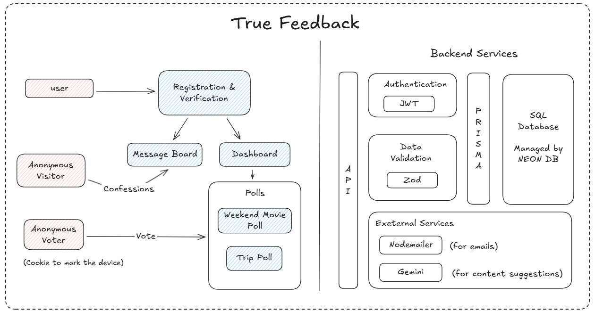

# True Feedback

> **Anonymous Messaging & Authentic Polling Platform**  
> Empowering honest communication through anonymity and secure voting mechanisms.

## 1️⃣ Project Overview
**True Feedback** is a platform designed to facilitate open and honest communication. It allows users to receive anonymous messages from anyone through a unique public link. Beyond messaging, it features a robust polling system where users can create polls and receive authentic votes from the community.



## 2️⃣ Features
-   **Anonymous Messaging**: Send and receive messages without revealing identity.
-   **User Dashboard**: Registered users can view, manage, and analyze received messages.
-   **Secure Authentication**: Email-based OTP verification for genuine user registration.
-   **polls**: Create custom polls with multiple candidates.
-   **Vote Integrity**: Cookie-based device fingerprinting to prevent multiple votes from the same device while maintaining voter anonymity.
-   **AI Integration**: content suggestions using Google Generative AI.
-   **Public & Private Results**: Option to make poll results public or private.

## 3️⃣ Tech Stack
-   **Language**: TypeScript
-   **Runtime**: Node.js
-   **Framework**: Express.js
-   **Database**: PostgreSQL (via Neon Serverless)
-   **ORM**: Prisma
-   **Authentication**: JWT & Nodemailer (OTP)
-   **Validation**: Zod
-   **AI**: Google Gemini SDK

## 4️⃣ Setup Instructions

### Prerequisites
-   Node.js & npm installed
-   PostgreSQL database (or Neon connection string)

### Steps
1.  **Clone the repository**
    ```bash
    git clone https://github.com/Shwet-Patel/true-feedback-REWAMP.git
    cd true-feedback-REWAMP
    ```

2.  **Install dependencies**
    ```bash
    npm install
    ```

3.  **Configure Environment Variables**
    Create a `.env` file in the root directory. You can use the provided `.env-sample` as a template:
    ```bash
    cp .env-sample .env
    ```
    And update the variables with your credentials (database, email, etc).

4.  **Database Setup**
    ```bash
    # Generate Prisma Client
    npx prisma generate
    
    # Run Migrations
    npx prisma migrate dev
    ```

5.  **Run the Application**
    ```bash
    # Development Mode
    npm run dev
    
    # Production Build
    npm run build
    npm start
    ```

## 5️⃣ API Overview
The API is documented using Swagger.
-   **Documentation**: Visit `http://localhost:4000/api-docs` after starting the server.
-   **Base URL**: `http://localhost:4000/api`

### Key Endpoints
-   `POST /api/auth/register` - Register a new user
-   `POST /api/auth/verify-otp` - Verify email OTP
-   `POST /api/messages/send` - Send anonymous message
-   `POST /api/polls/create` - Create a new poll
-   `POST /api/polls/vote` - Vote on a poll

## 6️⃣ Architecture Notes

### Database Design
The application uses a **Relational Database (PostgreSQL)** managed via **Prisma ORM**.
-   **User Table**: Stores user credentials, verification status, and OTPs.
-   **Message Table**: Linked to users (recipients) with timestamps.
-   **Poll Table**: Stores poll metadata, options (JSON), and vote counts.
-   **Relationships**: Strong foreign key constraints ensure data integrity (e.g., cascading deletes for user data).

### Scaling Strategy
-   **Stateless Backend**: The Express application is stateless (using JWT), allowing for easy horizontal scaling across multiple instances or containers.
-   **Serverless Database**: Utilizing **Neon Postgres** allows the database layer to auto-scale based on load without managing infrastructure.

### Security Approach
-   **Data Integrity**: Zod schemas validate all incoming requests to prevent malformed data.
-   **Authentication**: Secure password hashing (bcrypt) and OTPs for email verification.
-   **Vote Security**: Uses persistent HTTP-only cookies to track voting status per device, balancing the need for unique votes with user anonymity (no login required for voters).

---
**Author**: [Shwet-Patel](https://github.com/Shwet-Patel)